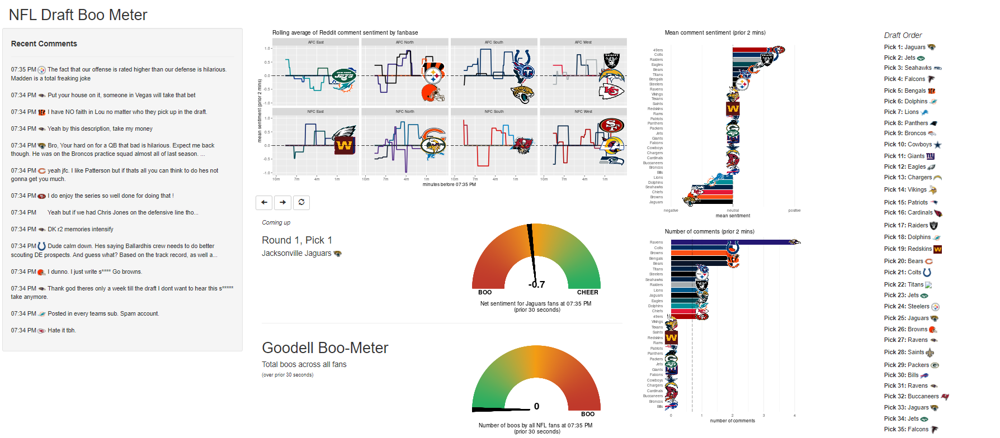

## Original Project

This app is basically just a 2021 update to [Caio Brighenti 's 2020 NFL Draft Sentiment app](https://github.com/CaioBrighenti/nfl-draft-sentiment), so mad props to [Caio](https://twitter.com/CaioBrighenti). I made edits to:

-   accomodate changes made by [Nick Wan](https://twitter.com/nickwan) to [the python scraper, which now lives in a Google Colab notebook](https://colab.research.google.com/drive/1xqhha1pujecHhus95fjTxJNwArn8Jx0G#scrollTo=-HAG-Mpc8bb8),
-   account for miscellaneous logistics, e.g. the 2021 NFL draft order and the Washington Football Team's name change,
-   deploy the Shiny app with [RStudio Connect](https://docs.rstudio.com/connect/user/publishing/) to <https://tonyelhabr.shinyapps.io/nfl-draft-sentiment/>.



## Authentication Setup

See [this documentation](https://gargle.r-lib.org/articles/non-interactive-auth.html) for more details, but otherwise, just run the following commands

``` r
# install.packages(c('gargle', 'googledrive'))
options(gargle_oauth_cache = '.secrets')
gargle::gargle_oauth_cache()
googledrivedrive_auth()
```
